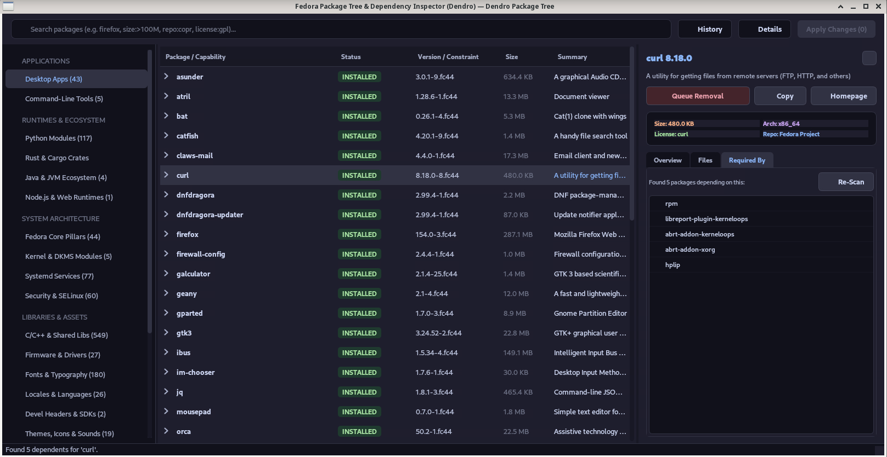

<div align="center">
<p align="center"></p>
# 🌳 Dendro

### Modern Graphical Package Manager & Interactive Dependency Explorer for Fedora Linux

[](https://www.gnu.org/licenses/gpl-3.0)
[](https://getfedora.org)
[](https://www.python.org/)
[](https://riverbankcomputing.com/software/pyqt/)
[](https://github.com/xyasharx/Dendro/actions)

<p align="center">
  <a href="#-key-features">Key Features</a> •
  <a href="#-installation">Installation</a> •
  <a href="#-quick-start">Quick Start</a> •
  <a href="#-architecture">Architecture</a> •
  <a href="#-contributing">Contributing</a> •
  <a href="#-license">License</a>
</p>

---

</div>

**Dendro** is a fast, modern graphical package manager and visual dependency hierarchy explorer built specifically for Fedora Linux. It empowers users and developers to visually navigate package relationships, identify orphan packages, and manage software safely with native Polkit privileges.

---

## ✨ Key Features

- 🌳 **Interactive Multi-Level Dependency Tree**: Expand any package to inspect its full dependency graph—direct requirements, sub-dependencies, and virtual RPM capabilities—rendered in a collapsible tree view.
- ⚡ **Asynchronous Non-Blocking Core**: All RPM database queries and transaction pipelines run in dedicated background threads (`QThreadPool`), keeping the interface smooth and responsive.
- 🔄 **Smart Cycle & Orphan Management**: Automatically isolates unneeded leaf packages (orphans) to keep your system clean, with built-in DAG cycle detection to prevent recursive dependency loops.
- 🔒 **Native Polkit Privileges**: Safely elevates privileges for installation and removal using standard system authentication (`pkexec dnf`).
- 🎨 **Modern Flat Dark Interface**: High-DPI optimized dark UI featuring native-painted status pills, SVG branch indicators, and a real-time transaction log drawer.
- 📦 **Transaction Queue & Live Preview**: Stage multiple operations (Install / Remove) and review total changes and disk footprint before applying.

---

## 📸 Screenshots

<div align="center">
  
</div>

---

## 🚀 Installation

### Option 1: Native Fedora RPM via COPR (Recommended)

Dendro is available through Fedora COPR with automated system updates:

```bash
# Enable the Dendro repository
sudo dnf copr enable xyasharx/dendro -y

# Install Dendro
sudo dnf install -y dendro

# Launch Dendro
dendro
```

---

### Option 2: Standalone Portable AppImage

Download the self-contained binary from the [Releases](https://github.com/xyasharx/dendro/releases) page:

```bash
# Make the AppImage executable
chmod +x Dendro-x86_64.AppImage

# Run directly
./Dendro-x86_64.AppImage
```

---

### Option 3: Flathub (Flatpak)

Install Dendro directly from Flathub:

```bash
flatpak install flathub io.github.xyasharx.Dendro
flatpak run io.github.xyasharx.Dendro
```

---

### Option 4: Run from Source

```bash
# 1. Clone the repository
git clone https://github.com/xyasharx/dendro.git
cd dendro

# 2. Install system dependencies on Fedora
sudo dnf install -y python3 python3-pip qt6-qtbase polkit

# 3. Create and activate a virtual environment with system access
python3 -m venv --system-site-packages venv
source venv/bin/activate

# 4. Install requirements and run
pip install -r requirements.txt
python3 main.py
```

---

## ⌨️ Usage & Navigation

| Action | How to Perform |
| :--- | :--- |
| **Inspect Dependencies** | Click the expand arrow `▶` next to any package in the tree. |
| **Queue for Installation / Removal** | Right-click any package row and choose **Queue Install** or **Queue Removal**. |
| **Search Packages** | Type in the top search bar (includes real-time 250ms debouncing). |
| **Filter by Category** | Select **All**, **Installed**, **Development**, **System**, or **Orphans** in the sidebar. |
| **Execute Pending Changes** | Click the **Apply Changes** button in the header to open the transaction drawer. |

---

## 🛠️ Project Architecture

Dendro is built using a strict Model-View-Controller (MVC) design pattern separating RPM database operations from Qt presentation:

```text
dendro/
├── core/
│   ├── backend.py            # RPM/DNF queries, DAG graph resolver & Polkit runner
│   └── models.py             # Custom QAbstractItemModel & QSortFilterProxyModel
├── ui/
│   ├── delegates.py          # QPainter-rendered status badges and metadata tags
│   ├── header.py             # Debounced search bar and queue action trigger
│   ├── main_window.py        # Central MVC application controller
│   ├── sidebar.py            # Category navigation with live counters
│   ├── styles.py             # Flat modern dark stylesheet with embedded SVGs
│   └── transaction_drawer.py # Real-time terminal log viewer & progress monitor
├── data/                     # XDG Desktop entries, icons, and Polkit policies
└── main.py                   # High-DPI bootstrap & POSIX signal handlers
```

---

## 🧪 Running Automated Tests

Dendro includes a headless test suite for continuous integration:

```bash
# Run unit tests with pytest
pytest -v tests/
```

---

## 🤝 Contributing

Contributions, issues, and feature requests are welcome!

1. Fork the repository
2. Create your feature branch (`git checkout -b feature/AmazingFeature`)
3. Commit your changes (`git commit -m 'feat: add some AmazingFeature'`)
4. Push to the branch (`git push origin feature/AmazingFeature`)
5. Open a Pull Request

---

## 📄 License

This project is licensed under the **GNU General Public License v3.0 (GPL-3.0-or-later)**. See the [LICENSE](LICENSE) file for details.

---

<div align="center">
  <sub>Built with ❤️ for the Fedora Linux community.</sub>
</div>
