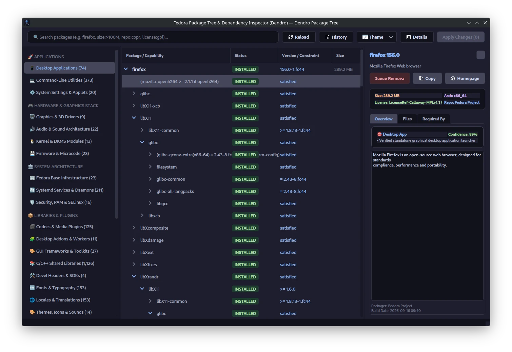

<div align="center">
<p align="center">
  
</p>

# Dendro

### Native Graphical Package Manager & Dependency Tree Explorer for Fedora Linux

[](https://www.gnu.org/licenses/gpl-3.0)
[](https://getfedora.org)
[](https://www.python.org/)
[](https://riverbankcomputing.com/software/pyqt/)
[](https://github.com/xyasharx/Dendro/releases)
[](https://copr.fedorainfracloud.org/coprs/xyasharx/dendro/)

<p align="center">
  <a href="#key-features">Key Features</a> •
  <a href="#installation">Installation</a> •
  <a href="#search-syntax">Search Syntax</a> •
  <a href="#keyboard-shortcuts">Shortcuts</a> •
  <a href="#architecture">Architecture</a> •
  <a href="#license">License</a>
</p>

---

</div>

**Dendro** is a graphical package manager and dependency hierarchy explorer built specifically for Fedora Linux. Powered by native **`librpm`** and **`libdnf5`** bindings, it provides in-process package querying, interactive dependency tree navigation, reverse dependency lookups ("what depends on this package?"), system update tracking, package file integrity audits (`rpm -V`), native changelog inspection with CVE links, software repository management, dynamic light/dark theming, and safe DNF transaction management with Polkit authentication.

---

## Key Features

- **⚡ Native `librpm` & `libdnf5` Integration:** Direct in-process access to the local RPM database and DNF5 solver sacks, avoiding the latency and fragility of parsing terminal text.
- **🎨 Dynamic Light/Dark Theming:** Automatically synchronizes with your desktop's color scheme via Qt 6 FreeDesktop portal integration (GNOME and KDE Plasma). Includes a theme dropdown menu with 6 curated palettes (Catppuccin Mocha/Latte, Tokyo Night, Nord, Solarized Light, Gruvbox) and persistent configuration via `QSettings`.
- **💾 Two-Tier Capability Cache:** Combines fast in-memory caching with a persistent SQLite WAL database (`~/.cache/dendro/`) to prevent repeated capability and provider lookups across sessions.
- **🌳 Interactive Dependency Tree:** Expand any package to inspect its full dependency chain, direct requirements, and virtual RPM capabilities in an expandable tree view.
- **🔍 Reverse Dependency Explorer:** Check which installed packages rely on a specific library before removing it to prevent breaking desktop components.
- **🛡️ Package File Integrity Auditor (`rpm -V`):** Runs native cryptographic and permission checks on installed files directly from the Files tab, flagging tampered digests, altered sizes, modified permissions, and missing files.
- **📋 Native RPM Changelog & CVE Linker:** Reads maintainer release notes directly from local RPM headers with zero network delay, automatically linking CVE numbers and Bugzilla IDs to the official Red Hat Security Database.
- **🆙 Live System Updates & Advisories:** Integrates with DNF5 (`check-upgrade`) to detect pending updates and security advisories, display upgrade version paths, and trigger upgrades safely.
- **📦 Software Repository & COPR Manager:** Enable or disable Fedora Core, Updates Testing, and RPM Fusion channels, or enable community COPR repositories with one click.
- **🛡️ Dry-Run & Safety Guardrails:** Simulates transactions before execution. Dendro warns you immediately if critical system pillars (`kernel`, `systemd`, `glibc`, `gnome-shell`, `plasma-desktop`, `NetworkManager`) are slated for removal.
- **🏷️ Fine-Grained Package Classifier:** Uses strictly anchored path checks and top-down precedence to categorize packages into dedicated groups—including Graphics Drivers, Audio Stack, Media Plugins, Toolkits, Desktop Addons, and Settings Applets. Accurately separates user CLI tools from background daemons and eliminates false positives.
- **👤 Explicit User-Installed Tracking:** Differentiates packages explicitly requested by the user from background dependencies and orphan packages.
- **🕒 DNF History & Rollback:** Review past package installations, updates, and removals with support for undoing transactions (`dnf history undo`).
- **🐳 Container & Root Support:** Automatically detects `UID 0` when running inside Docker, Podman, or cloud environments, executing operations directly without failing on missing Polkit or D-Bus services.
- **🔒 Polkit Privilege Elevation:** For standard desktop sessions, root actions run securely via system authentication (`pkexec dnf5/dnf`) with live streaming terminal output and sequential transaction safety.

---

## Screenshots

<div align="center">
  
</div>

---

## Installation

### Option 1: Native Fedora RPM via COPR (Recommended)

Enable the COPR repository and install Dendro via DNF:

```bash
# Enable the repository
sudo dnf copr enable xyasharx/dendro -y

# Install Dendro
sudo dnf install dendro -y

# Launch
dendro
```

---

### Option 2: Standalone Portable AppImage

Download the latest AppImage from the [Releases](https://github.com/xyasharx/Dendro/releases) page:

```bash
# Make the AppImage executable
chmod +x Dendro-x86_64.AppImage

# Run
./Dendro-x86_64.AppImage
```

> **Note:** The AppImage sanitizes environment variables (such as `LD_LIBRARY_PATH`) prior to calling host commands to prevent bundled libraries from conflicting with the system package manager.

---

### Option 3: Run from Source

```bash
# 1. Clone the repository
git clone https://github.com/xyasharx/Dendro.git
cd Dendro

# 2. Install native dependencies and bindings on Fedora
sudo dnf install -y python3 python3-devel python3-pyqt6 python3-rpm python3-libdnf5 polkit rpm dnf5 adwaita-icon-theme google-noto-color-emoji-fonts

# 3. Set up a virtual environment with system site packages enabled
# (Required so the venv can access system-level python3-rpm and python3-libdnf5 bindings)
python3 -m venv --system-site-packages venv
source venv/bin/activate

# 4. Install test/dev requirements and run
pip install -r requirements.txt
python3 main.py
```

---

### Option 4: Flatpak *(Planned)*

Flatpak packaging is planned for upcoming releases utilizing `flatpak-spawn --host` to interact with host DNF/RPM subsystems safely.

---

## Search Syntax

The search bar updates results in real time with built-in 250ms debouncing and supports filter prefixes:

| Query Example | Description |
| :--- | :--- |
| `firefox` | Searches package names, summaries, and descriptions |
| `status:update` or `status:upgradable` | Shows installed packages with pending updates available |
| `status:user` or `status:manual` | Shows packages explicitly installed by the user |
| `status:orphan` | Displays unneeded leaf dependencies (orphans) |
| `status:queued` | Shows packages staged for installation or removal |
| `arch:x86_64` or `arch:noarch` | Filters packages by CPU architecture |
| `cat:graphics_driver` or `cat:theme` | Filters packages by primary category key |
| `tag:python` or `tag:rust` | Filters packages by programming language ecosystem |
| `size:>100M` or `size:<50K` | Filters packages by installed disk size (`B`, `K`, `M`, `G`) |
| `repo:copr` | Filters packages installed from COPR repositories |
| `repo:fusion` | Filters packages from RPM Fusion repositories |
| `license:gpl` or `license:mit` | Filters packages by software license |

---

## Keyboard Shortcuts

| Shortcut | Action |
| :--- | :--- |
| <kbd>Ctrl</kbd> + <kbd>F</kbd> | Focus the search bar |
| <kbd>Ctrl</kbd> + <kbd>R</kbd> | Reload and re-index system RPM database |
| <kbd>Ctrl</kbd> + <kbd>H</kbd> | Open DNF Transaction History & Rollback dialog |
| <kbd>Ctrl</kbd> + <kbd>I</kbd> | Toggle Package Inspector side panel |
| <kbd>Space</kbd> | Toggle Install / Remove queue state for selected package |

---

## Architecture

Dendro isolates native `librpm`/`libdnf5` queries into background worker threads (`QThreadPool`) to keep the PyQt6 user interface fluid:

```text
dendro/
├── core/
│   ├── backend.py            # Native librpm/libdnf5 engine, classifier, integrity auditor & repo helper
│   └── models.py             # TreeItem, DependencyTreeModel & filter proxy models
├── ui/
│   ├── delegates.py          # Adaptive theme branch rendering and badge styling
│   ├── dry_run_dialog.py     # Transaction simulation and critical package warnings
│   ├── header.py             # Search bar, update indicators, repo launcher & theme selection
│   ├── history_dialog.py     # DNF transaction history and rollback viewer
│   ├── inspector_panel.py    # Package metadata, file list with rpm -V audit, CVE changelog & reverse deps
│   ├── main_window.py        # Main window controller, theme persistence & background thread pool
│   ├── repo_dialog.py        # Software repository & COPR channel manager
│   ├── sidebar.py            # Categorized navigation with live item counts across 29 categories
│   ├── styles.py             # Multi-theme palettes, dynamic QSS builder & desktop portal detector
│   └── transaction_drawer.py # Terminal console output and progress drawer
├── data/
│   ├── icons/                # High-DPI application icons
│   ├── io.github.xyasharx.Dendro.desktop      # Desktop entry file
│   ├── io.github.xyasharx.Dendro.metainfo.xml # AppStream metadata
│   └── org.dendro.policy       # Polkit policy for privileged actions
├── dendro.spec                 # Fedora RPM packaging spec (COPR compliant)
└── main.py                     # Entry point, icon theme fallbacks & uncaught exception handling
```

---

## Running Tests

Run the test suite headlessly:

```bash
pytest -v tests/
```

---

## Contributing

Bug reports, suggestions, and pull requests are welcome.

1. Fork the repository
2. Create your branch (`git checkout -b feature/your-feature`)
3. Commit your changes (`git commit -m 'Add feature'`)
4. Push to the branch (`git push origin feature/your-feature`)
5. Open a Pull Request

---

## License

This project is licensed under the **GNU General Public License v3.0 (GPL-3.0-or-later)**. See the [LICENSE](LICENSE) file for details.

---

<div align="center">
  <sub>Built for the Fedora Linux community.</sub>
</div>
