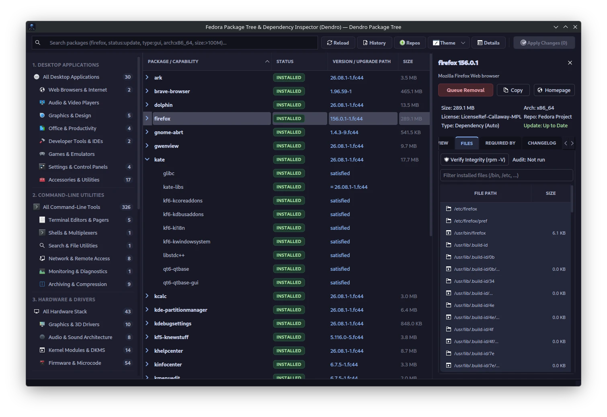
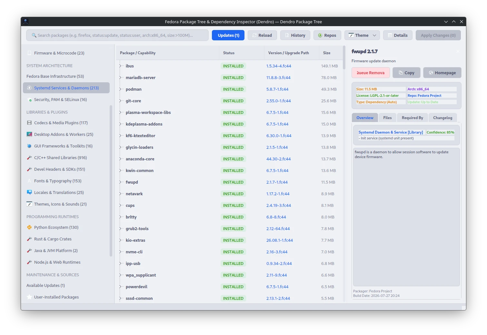

<div align="center">
<p align="center">
  
</p>

# Dendro

### Native Graphical Package Manager and Dependency Tree Explorer for Fedora Linux

[](https://www.gnu.org/licenses/gpl-3.0)
[](https://getfedora.org)
[](https://www.python.org/)
[](https://riverbankcomputing.com/software/pyqt/)
[](https://github.com/xyasharx/Dendro/releases)
[](https://copr.fedorainfracloud.org/coprs/xyasharx/dendro/)

<p align="center">
  <a href="#key-features">Key Features</a> |
  <a href="#installation">Installation</a> |
  <a href="#search-syntax">Search Syntax</a> |
  <a href="#keyboard-shortcuts">Shortcuts</a> |
  <a href="#architecture">Architecture</a> |
  <a href="#license">License</a>
</p>

---

</div>

**Dendro** is a graphical package manager and dependency hierarchy inspector built for Fedora Linux. Powered by native **`librpm`** and **`libdnf5`** bindings, it provides in-process package querying, interactive dependency tree navigation, reverse dependency lookups ("what depends on this package?"), system update tracking, package file integrity audits (`rpm -V`), local RPM changelog inspection with CVE links, repository management, and safe DNF transactions via Polkit authentication.

---

## Key Features

- **Native librpm and libdnf5 Integration:** Queries the local RPM database and DNF5 solver sacks directly in-process via C/C++ bindings, avoiding the overhead and fragility of parsing terminal output.
- **Two-Tier System Taxonomy:** Categorizes packages across 6 core pillars (Desktop Applications, CLI Utilities, Hardware & Drivers, System Architecture, Libraries, and Maintenance). Granular subcategories are derived deterministically from FreeDesktop XDG desktop entries, AppStream 1.0+ metadata, and local Fedora `comps.xml` repository definitions.
- **High-Contrast Theme Engine:** Adapts automatically to desktop color schemes (GNOME and KDE Plasma) via Qt 6 FreeDesktop portal integration. Automatically pairs dark palettes with dark-mode icon sets (`breeze-dark`, `Papirus-Dark`) and light palettes with light-mode icon sets (`breeze`, `Adwaita`), synchronizing the application palette to prevent icon contrast failure.
- **Deterministic Removal Safety Auditor:** Replaces guesswork with direct `librpm` reverse-dependency DAG checks and `/etc/dnf/protected.d` verification. Instantly reports whether a package is a safe leaf orphan or a protected core component before any transaction is staged.
- **Two-Tier Capability Cache:** Uses an in-memory L1 cache backed by a persistent SQLite WAL database (`~/.cache/dendro/`) to prevent duplicate capability and provider lookups across sessions.
- **Interactive Dependency Tree:** Displays multi-level dependency chains, direct requirements, and virtual RPM capabilities in an expandable tree view with cycle detection.
- **Reverse Dependency Explorer:** Checks which installed packages depend on a target library before removal to prevent breaking desktop components.
- **File Integrity Verification (`rpm -V`):** Runs cryptographic checksum and permission checks on installed files directly from the Files tab, flagging tampered digests, altered sizes, modified permissions, and missing files.
- **Local RPM Changelog with CVE Linking:** Reads maintainer release notes directly from local RPM headers without network requests, automatically linking CVE numbers and Bugzilla IDs to the official Red Hat Security Database.
- **Live System Updates and Advisories:** Integrates with DNF5 (`check-upgrade`) to detect pending updates and security advisories, display version upgrade paths, and stage upgrades.
- **Repository and COPR Manager:** Enables or disables Fedora Core, Updates Testing, and RPM Fusion channels, and handles one-click enablement of community COPR repositories.
- **Dry-Run Transaction Guardrails:** Simulates transactions prior to execution and flags removals that affect critical system components (`kernel`, `systemd`, `glibc`, `NetworkManager`).
- **DNF History and Rollback:** Lists past package installations, updates, and removals with support for undoing transactions (`dnf history undo`).
- **Polkit Privilege Elevation:** Administrative operations run through system authentication (`pkexec dnf5/dnf`) with live streaming terminal output and sequential multi-stage execution.

---

## Screenshots

<div align="center">
  
  
</div>

---

## Installation

### Option 1: Native Fedora RPM via COPR (Recommended)

Enable the repository and install Dendro via DNF:

```bash
# Enable the repository
sudo dnf copr enable xyasharx/dendro -y

# Install Dendro
sudo dnf install dendro -y

# Launch
dendro
```

---

### Option 2: Standalone AppImage

Download the latest AppImage from the [Releases](https://github.com/xyasharx/Dendro/releases) page:

```bash
chmod +x Dendro-x86_64.AppImage
./Dendro-x86_64.AppImage
```

---

### Option 3: Run from Source

```bash
# 1. Clone the repository
git clone https://github.com/xyasharx/Dendro.git
cd Dendro

# 2. Install runtime dependencies on Fedora
sudo dnf install -y python3 python3-devel python3-pyqt6 python3-rpm python3-libdnf5 polkit rpm dnf5 adwaita-icon-theme

# 3. Set up a virtual environment with system site-packages enabled
# (Required so the virtual environment can load python3-rpm and python3-libdnf5 bindings)
python3 -m venv --system-site-packages venv
source venv/bin/activate

# 4. Install development requirements and run
pip install -r requirements.txt
python3 main.py
```

---

## Search Syntax

The search bar filters packages in real time with built-in 250ms debouncing and supports filter prefixes:

| Query Example | Description |
| :--- | :--- |
| `firefox` | Searches package names, summaries, and descriptions |
| `type:gui` or `type:cli` | Filters by interface form factor (Desktop App vs CLI Tool vs Service) |
| `pillar:apps` or `pillar:hardware` | Filters by primary system pillar |
| `sub:desktop_internet` | Filters by granular subcategory key |
| `status:update` or `status:upgradable` | Shows installed packages with pending updates |
| `status:user` or `status:manual` | Shows packages explicitly installed by the user |
| `status:orphan` | Displays unneeded leaf dependencies |
| `status:queued` | Shows packages staged for installation or removal |
| `arch:x86_64` or `arch:noarch` | Filters packages by CPU architecture |
| `cat:graphics_driver` or `cat:theme` | Filters packages by category key |
| `tag:python` or `tag:rust` | Filters packages by programming language ecosystem |
| `size:>100M` or `size:<50K` | Filters packages by installed disk size (`B`, `K`, `M`, `G`) |
| `repo:copr` | Filters packages installed from COPR repositories |
| `repo:fusion` | Filters packages from RPM Fusion repositories |
| `license:gpl` or `license:mit` | Filters packages by software license |

---

## Keyboard Shortcuts

| Shortcut | Action |
| :--- | :--- |
| <kbd>Ctrl</kbd> + <kbd>F</kbd> | Focus the search bar |
| <kbd>Ctrl</kbd> + <kbd>R</kbd> | Reload and re-index system RPM database |
| <kbd>Ctrl</kbd> + <kbd>H</kbd> | Open DNF Transaction History & Rollback dialog |
| <kbd>Ctrl</kbd> + <kbd>I</kbd> | Toggle Package Inspector side panel |
| <kbd>Space</kbd> | Toggle Install / Remove queue state for selected package |

---

## Architecture

Dendro runs native `librpm` and `libdnf5` queries in background worker threads (`QThreadPool`) to prevent blocking the Qt event loop:

```text
dendro/
├── core/
│   ├── backend.py            # Native librpm/libdnf5 engine, comps parser, taxonomy classifier & auditor
│   └── models.py             # TreeItem, DependencyTreeModel & two-tier filter proxy model
├── ui/
│   ├── delegates.py          # Vector branch rendering and status badge styling
│   ├── dry_run_dialog.py     # Transaction simulation and critical package removal warnings
│   ├── header.py             # Search input, update counter, repo manager trigger & theme picker
│   ├── history_dialog.py     # DNF transaction history and rollback viewer
│   ├── inspector_panel.py    # Package metadata, file list with rpm -V verification, CVE changelog & reverse deps
│   ├── main_window.py        # Main window controller, palette synchronization & background thread pool
│   ├── repo_dialog.py        # Software repository & COPR channel manager
│   ├── sidebar.py            # Two-tier navigation sidebar with live counters across all 6 pillars
│   ├── styles.py             # Multi-theme palettes, dynamic QSS builder & desktop portal listener
│   └── transaction_drawer.py # Terminal console drawer for streaming Polkit execution logs
├── data/
│   ├── icons/                # High-DPI application icons
│   ├── io.github.xyasharx.Dendro.desktop      # Desktop entry file
│   ├── io.github.xyasharx.Dendro.metainfo.xml # AppStream 1.0+ metadata
│   └── org.dendro.policy       # Polkit policy for privileged actions
├── dendro.spec                 # Fedora RPM packaging spec
└── main.py                     # Entry point, icon search paths & uncaught exception handler
```

---

## Running Tests

Run the test suite headlessly:

```bash
pytest -v tests/
```

---

## Contributing

Bug reports, suggestions, and pull requests are welcome.

1. Fork the repository
2. Create your branch (`git checkout -b feature/your-feature`)
3. Commit your changes (`git commit -m 'Add feature'`)
4. Push to the branch (`git push origin feature/your-feature`)
5. Open a Pull Request

---

## License

This project is licensed under the **GNU General Public License v3.0 (GPL-3.0-or-later)**. See the [LICENSE](LICENSE) file for details.
